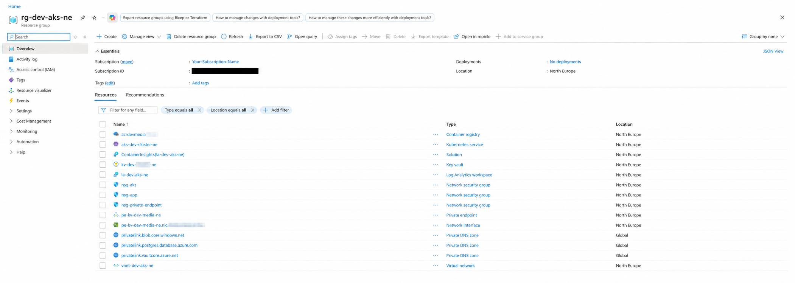
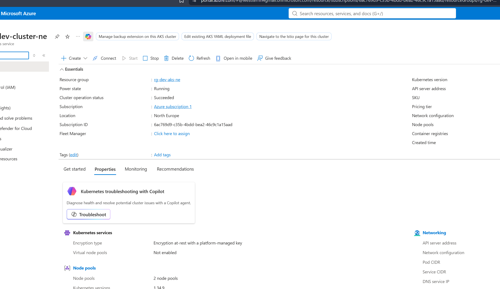
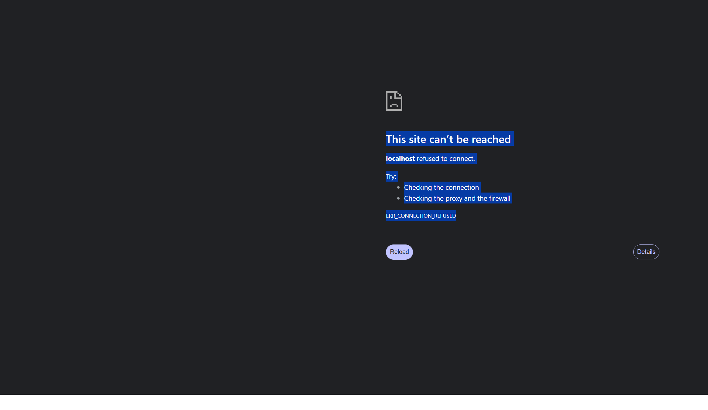

# Enterprise AKS Platform — Zero Trust GitOps Infrastructure

Production-grade Kubernetes platform in Azure, built with **Terraform**, delivered with **GitOps (Argo CD)**, secured with a **Zero Trust** model, and observable end-to-end.

> **This is a demo/portfolio project, not production software.** It demonstrates how a real enterprise Kubernetes platform is designed: everything is code, nothing lives in git that should live in a vault, and the cluster restores itself from a git repository.

[Українська версія](README.ua.md)

---

## Why this project exists

Most "Kubernetes projects" are a single nginx pod. This project is the opposite: a thin demo application
(`media-api` + worker + PostgreSQL + Redis) wrapped in an enterprise platform. About **80% of the complexity
is in the platform** — networking, security, GitOps, observability, scaling — and only 20% in the app itself.

The result is a single artifact you can show at an interview and defend:

- provision the whole stack with `terraform apply`,
- push a commit and watch Argo CD deploy it,
- load-test and watch HPA + Cluster Autoscaler react,
- kill a pod and watch Kubernetes restore it,
- show Grafana dashboards and Key Vault secrets that never touch git.

## Current status

| Component | Status |
|---|---|
| VNet + subnets + NSG + private DNS | ✅ live |
| ACR `acrdevmedia.azurecr.io` | ✅ live |
| Key Vault + private endpoint | ✅ live |
| PostgreSQL (private endpoint, password in KV) | ✅ live |
| AKS 1.34 (Cilium, OIDC, Workload Identity, CSI) | ✅ live |
| Log Analytics / Azure Monitor | ✅ live |
| GitOps (Argo CD) | ✅ live — app-of-apps + cluster-config Synced |
| Demo application (FastAPI) | 📋 next |
| CI/CD (GitHub Actions) | 📋 next |
| Prometheus + Grafana | 📋 next |

## Architecture (simplified)

```
                INTERNET
                   │
                   ▼
         ┌───────────────────┐
         │  Azure Front Door │   (planned)
         │  WAF              │
         └─────────┬─────────┘
                   │
         ┌─────────▼─────────┐
         │ Application GW    │   (planned)
         └─────────┬─────────┘
═══════════════════╪════════════════════
                AZURE
                   │
         ┌─────────▼──────────┐
         │        VNet        │
         │  snet-aks / app /  │
         │  private-endpoint  │
         │                    │
         │  ┌──────────────┐  │
         │  │  AKS (1.34)  │  │
         │  │  Cilium      │  │
         │  │  Argo CD     │  │
         │  │  media-api   │  │
         │  │  worker      │  │
         │  │  redis       │  │
         │  └──────┬───────┘  │
         │         │          │
         └─────────┼──────────┘
                   │
        ┌──────────▼──────────┐
        │  Key Vault          │
        │  Secrets Store CSI  │
        │  Workload Identity  │
        └──────────┬──────────┘
                   │
        ┌──────────▼──────────┐
        │  PostgreSQL         │
        │  private endpoint   │
        └─────────────────────┘

          OBSERVABILITY
        Prometheus • Grafana
        Azure Monitor
```

Full diagram and details: [docs/architecture.md](docs/architecture.md).

## GitOps in action

Everything inside the cluster is declared in the
[enterprise-aks-gitops](https://github.com/Western-1/enterprise-aks-gitops) repository.
Argo CD watches it and makes the cluster match it — nobody applies manifests by hand:

```
git push → Argo CD (app-of-apps) → creates/clusters Applications → cluster converges
```

Current apps managed by Argo CD: `cluster-config` (namespaces `media`, `database`,
`monitoring`, `ingress` + ResourceQuota/LimitRange).

## Repo layout

```
terraform/
├── modules/                 reusable Terraform modules
│   ├── networking/          VNet, subnets, NSG, private DNS
│   ├── acr/                 container registry
│   ├── key-vault/           vault + RBAC + private endpoint
│   ├── monitoring/          Log Analytics
│   ├── aks/                 cluster, node pools, OIDC, Workload Identity
│   └── postgres/            flexible server + private endpoint + KV secrets
└── environments/
    ├── dev/                 current working environment (northeurope)
    ├── staging/             planned
    └── prod/                planned
docs/
├── architecture.md          deep dive (EN) / architecture.ua.md (UA)
├── costs.md                 cost tracking (EN) / costs.ua.md (UA)
├── playbook.md              every command explained (EN) / playbook.ua.md (UA)
└── screenshots/             evidence for the portfolio
```

## Getting started

Prerequisites: `terraform`, `az` (Azure CLI), `kubectl`, `helm`, and an active Azure subscription.

```bash
# 1. login
az login

# 2. create a local tfvars (never commit real values)
cp terraform/environments/dev/terraform.tfvars.example terraform/environments/dev/terraform.tfvars

# 3. provision everything
cd terraform/environments/dev
terraform init
terraform plan
terraform apply

# 4. connect kubectl to the cluster
az aks get-credentials --name aks-dev-cluster-ne --resource-group rg-dev-aks-ne
```

The full command reference with expected output is in [docs/playbook.md](docs/playbook.md).

## Zero Trust in practice

- **No secrets in git.** The PostgreSQL password is generated by Terraform and written
  straight into Key Vault (`db-password`, `db-url`). Pods read it via the **Secrets Store CSI driver**.
- **Workload Identity.** Pods authenticate to Azure with a federated service account — no client secrets.
- **Private networking.** Key Vault and PostgreSQL are reachable only through private endpoints.
- **RBAC everywhere.** Least-privilege roles; your user has exactly what the task needs.

Details: [docs/architecture.md](docs/architecture.md).

## Screenshots



*Resource group `rg-dev-aks-ne` in the Azure portal: VNet, ACR, Key Vault, PostgreSQL, AKS and Log Analytics are all provisioned by Terraform.*



*AKS cluster `aks-dev-cluster-ne` overview: Kubernetes 1.34, system and user node pools with autoscaling, Cilium networking.*



*Argo CD UI (port-forwarded): the login page of the GitOps controller that watches the enterprise-aks-gitops repository.*

## Costs

This is a trial subscription with **$200 free credits** — the card is never charged unless the
spending limit is explicitly removed. Current running infrastructure costs **~$210/month**,
which is why the cluster is started only when working. Full table: [docs/costs.md](docs/costs.md).

## Documentation index

| Doc | EN | UA |
|---|---|---|
| README | this file | [README.ua.md](README.ua.md) |
| Architecture | [architecture.md](docs/architecture.md) | [architecture.ua.md](docs/architecture.ua.md) |
| Costs | [costs.md](docs/costs.md) | [costs.ua.md](docs/costs.ua.md) |
| Playbook | [playbook.md](docs/playbook.md) | [playbook.ua.md](docs/playbook.ua.md) |