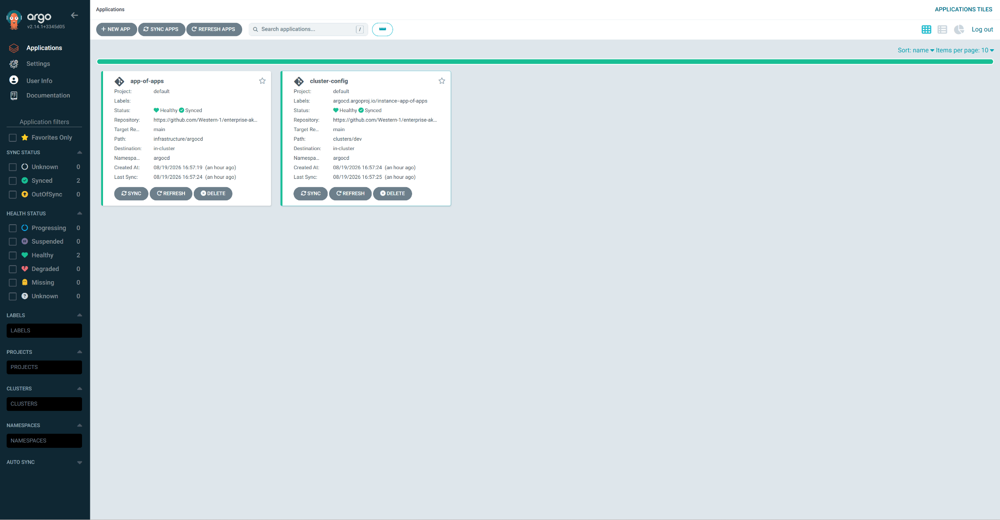

# Enterprise AKS Platform — Zero Trust GitOps Infrastructure

Production-рівень Kubernetes-платформа в Azure, побудована на **Terraform**, доставляється через **GitOps (Argo CD)**, захищена за моделлю **Zero Trust** і повністю спостережувана.

> **Це демо/портфоліо-проєкт, а не продакшн.** Він показує, як проєктується справжня корпоративна Kubernetes-платформа: усе — це код, нічого не живе в git, що мало жити у сховищі секретів, а кластер відновлюється сам з git-репозиторію.

[English version](README.md)

---

## Навіщо цей проєкт

Більшість «Kubernetes-проєктів» — це один nginx-под. Цей проєкт — протилежне: тонкий демо-застосунок
(`media-api` + worker + PostgreSQL + Redis), загорнутий у корпоративну платформу. Приблизно **80% складності —
в платформі** (мережа, безпека, GitOps, спостережуваність, масштабування), і лише 20% — у самому застосунку.

Результат — один артефакт, який можна показати на співбесіді й захистити:

- підняти весь стек однією командою `terraform apply`;
- запушити комміт і побачити, як Argo CD деплоїть;
- прогнати навантаження і побачити, як реагують HPA і Cluster Autoscaler;
- убити под і побачити, як Kubernetes його відновлює;
- показати дашборди Grafana і секрети Key Vault, які ніколи не потрапляли в git.

## Поточний статус

| Компонент | Статус |
|---|---|
| VNet + підмережі + NSG + private DNS | ✅ live |
| ACR `acrdevmedia.azurecr.io` | ✅ live |
| Key Vault + private endpoint | ✅ live |
| PostgreSQL (private endpoint, пароль у KV) | ✅ live |
| AKS 1.34 (Cilium, OIDC, Workload Identity, CSI) | ✅ live |
| Log Analytics / Azure Monitor | ✅ live |
| GitOps (Argo CD) | ✅ live — app-of-apps + cluster-config Synced |
| Демо-застосунок (FastAPI) | 📋 наступне |
| CI/CD (GitHub Actions) | 📋 наступне |
| Prometheus + Grafana | 📋 наступне |

## Архітектура (спрощено)

```
                INTERNET
                   │
                   ▼
         ┌───────────────────┐
         │  Azure Front Door │   (planned)
         │  WAF              │
         └─────────┬─────────┘
                   │
         ┌─────────▼─────────┐
         │ Application GW    │   (planned)
         └─────────┬─────────┘
═══════════════════╪════════════════════
                AZURE
                   │
         ┌─────────▼──────────┐
         │        VNet        │
         │  snet-aks / app /  │
         │  private-endpoint  │
         │                    │
         │  ┌──────────────┐  │
         │  │  AKS (1.34)  │  │
         │  │  Cilium      │  │
         │  │  Argo CD     │  │
         │  │  media-api   │  │
         │  │  worker      │  │
         │  │  redis       │  │
         │  └──────┬───────┘  │
         │         │          │
         └─────────┼──────────┘
                   │
        ┌──────────▼──────────┐
        │  Key Vault          │
        │  Secrets Store CSI  │
        │  Workload Identity  │
        └──────────┬──────────┘
                   │
        ┌──────────▼──────────┐
        │  PostgreSQL         │
        │  private endpoint   │
        └─────────────────────┘

          OBSERVABILITY
        Prometheus • Grafana
        Azure Monitor
```

Повна діаграма й деталі: [docs/architecture.ua.md](docs/architecture.ua.md).

## GitOps на практиці

Усе всередині кластера описано в репозиторії
[enterprise-aks-gitops](https://github.com/Western-1/enterprise-aks-gitops).
Argo CD стежить за ним і приводить кластер у відповідність — ніхто не застосовує маніфести вручну:

```
git push → Argo CD (app-of-apps) → створює/синхронізує Applications → кластер сходиться
```

Поточні застосунки під управлінням Argo CD: `cluster-config` (namespace `media`, `database`,
`monitoring`, `ingress` + ResourceQuota/LimitRange).



*Інтерфейс Argo CD: кореневий застосунок `app-of-apps` і `cluster-config` — обидва Synced і Healthy. Кластер сходиться з репозиторію enterprise-aks-gitops, без ручного kubectl apply.*

## Структура репозиторію

```
terraform/
├── modules/                 перевикористовувані Terraform-модулі
│   ├── networking/          VNet, підмережі, NSG, private DNS
│   ├── acr/                 container registry
│   ├── key-vault/           vault + RBAC + private endpoint
│   ├── monitoring/          Log Analytics
│   ├── aks/                 кластер, node pools, OIDC, Workload Identity
│   └── postgres/            flexible server + private endpoint + KV secrets
└── environments/
    ├── dev/                 поточне робоче середовище (northeurope)
    ├── staging/             заплановано
    └── prod/                заплановано
docs/
├── architecture.md          детально (EN) / architecture.ua.md (UA)
├── costs.md                 облік витрат (EN) / costs.ua.md (UA)
├── playbook.md              кожна команда пояснена (EN) / playbook.ua.md (UA)
└── screenshots/             докази для портфоліо
```

## Початок роботи

Передумови: `terraform`, `az` (Azure CLI), `kubectl`, `helm` і активна Azure-підписка.

```bash
# 1. вхід
az login

# 2. створити локальний tfvars (реальні значення ніколи не комітяться)
cp terraform/environments/dev/terraform.tfvars.example terraform/environments/dev/terraform.tfvars

# 3. підняти все
cd terraform/environments/dev
terraform init
terraform plan
terraform apply

# 4. підключити kubectl до кластера
az aks get-credentials --name aks-dev-cluster-ne --resource-group rg-dev-aks-ne
```

Повний довідник команд з очікуваним результатом — у [docs/playbook.ua.md](docs/playbook.ua.md).

## Zero Trust на практиці

- **Жодних секретів у git.** Пароль PostgreSQL генерує Terraform і одразу пише в Key Vault
  (`db-password`, `db-url`). Поди читають його через **Secrets Store CSI driver**.
- **Workload Identity.** Поди автентифікуються в Azure через федеративний service account — без client secrets.
- **Private networking.** Key Vault і PostgreSQL доступні лише через private endpoints.
- **RBAC всюди.** Ролі з мінімальними правами; ваш користувач має рівно стільки, скільки потрібно задачі.

Деталі: [docs/architecture.ua.md](docs/architecture.ua.md).

## Скріншоти


*Resource group `rg-dev-aks-ne` в Azure-порталі: VNet, ACR, Key Vault, PostgreSQL, AKS і Log Analytics — усе піднято Terraform.*


*AKS-кластер `aks-dev-cluster-ne`: Kubernetes 1.34, system і user node pools з автоскейлінгом, мережа Cilium.*

## Витрати

Це trial-підписка з **безкоштовними кредитами $200** — картка ніколи не списується, поки явно
не знято spending limit. Поточна інфраструктура коштує **~$210/міс**, тому кластер вмикають
тільки під час роботи. Повна таблиця: [docs/costs.ua.md](docs/costs.ua.md).

## Індекс документації

| Документ | EN | UA |
|---|---|---|
| README | цей файл | [README.ua.md](README.ua.md) |
| Архітектура | [architecture.md](docs/architecture.md) | [architecture.ua.md](docs/architecture.ua.md) |
| Витрати | [costs.md](docs/costs.md) | [costs.ua.md](docs/costs.ua.md) |
| Плейбук | [playbook.md](docs/playbook.md) | [playbook.ua.md](docs/playbook.ua.md) |