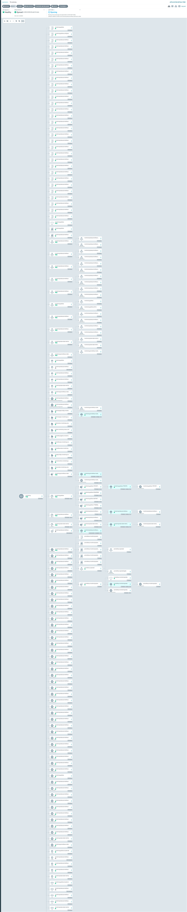

# Playbook — every command explained

[Українська версія](playbook.ua.md)

Commands are run from PowerShell on Windows. Everything below is verified.

## 1. Login and subscription

```powershell
az login --use-device-code   # if the WAM browser dialog does not open, this forces device-code flow
az account show              # confirm which subscription you are on
az account set --subscription "<name>"   # switch if you have several
```

> **Troubleshooting**: if `az login` hangs with `Broker enabled? True` in `--debug`,
> disable the WAM broker once: `az config set core.broker=off`.

## 2. Provision infrastructure (Terraform)

```powershell
cd terraform/environments/dev

# one-time: download providers
terraform init

# create local secrets file (never commit it)
# terraform.tfvars with subscription_id — already in .gitignore
terraform fmt -recursive    # formatting
terraform validate          # static checks
terraform plan              # see the diff
terraform apply             # apply (add -auto-approve to skip confirmation)
```

Expected result of `apply`: resources created in resource group `rg-dev-aks-ne`
(VNet, subnets, ACR, Key Vault, PostgreSQL, AKS, Log Analytics).

## 3. Connect kubectl

```powershell
az aks get-credentials --name aks-dev-cluster-ne --resource-group rg-dev-aks-ne --overwrite-existing
kubectl get nodes
kubectl get pods -A
```

Expected: two `system` nodes `Ready`, and system pods (cilium, gatekeeper,
`aks-secrets-store-csi-driver`, `ama-logs`) all `Running`.

## 4. Work with the Key Vault

```powershell
# list secret names (values are never printed to the repo)
az keyvault secret list --vault-name kv-dev-media-ne --query "[].name" --output table
```

> The vault is currently empty on purpose: the app authenticates passwordless
> (Entra ID), so the legacy `db-password` / `db-url` secrets were deleted.
> The admin password exists only in Terraform state (break-glass).

## 5. Scale / stop / start the cluster (saving money)

```powershell
# scale the whole user pool to 0 (it already does this by itself)
kubectl scale --replicas=0 deployment/<name>

# scale system pool nodes (saves ~$92/mo per node)
az aks scale --name aks-dev-cluster-ne --resource-group rg-dev-aks-ne --node-pool system --node-count 1

# complete teardown of everything
cd terraform/environments/dev
terraform destroy
```

> The cluster costs ~$210/month running 24/7. Stop it when you finish working.
> `terraform destroy` removes all resources and the state — the next `terraform apply`
> rebuilds the exact same platform.

## 6. Common checks

```powershell
az aks show --name aks-dev-cluster-ne --resource-group rg-dev-aks-ne --query "{state:provisioningState, version:kubernetesVersion}"
az postgres flexible-server show --name psql-dev-media-ne --resource-group rg-dev-aks-ne --query "{state:state, version:version}"
az acr show --name acrdevmedia --query "{loginServer:loginServer, sku:sku.name}"
```

### Quota-safe AKS upgrades

The dev subscription has four regional vCPUs, all used by the two system nodes.
The user pool uses `max_unavailable = "1"` in Terraform (no surge nodes). The
system (default) pool cannot — azurerm 4.81 supports only `max_surge` there —
so its zero-surge policy is applied once via CLI and persists (Terraform does
not manage that field, so there is no drift):

```powershell
az aks nodepool update --resource-group rg-dev-aks-ne --cluster-name aks-dev-cluster-ne --nodepool-name system --max-surge 0 --max-unavailable 1
```

One node can be unavailable during an upgrade; increase the regional vCPU quota
before changing to a surge policy.

## 7. Cost check

```powershell
# in the portal: Cost Management + Billing → Cost analysis → filter rg-dev-aks-ne
# update docs/costs.md and docs/costs.ua.md afterwards
```

## 8. Argo CD (GitOps)

Argo CD UI is public via an Azure Load Balancer (Standard, frontend IP from the cluster
outbound LB):

```powershell
# open in the browser (admin / initial password from the secret below)
# URL: http://<frontend-ip>/ — get it with:
kubectl get svc argocd-server -n argocd -o jsonpath="{.status.loadBalancer.ingress[0].ip}"

# initial admin password
kubectl -n argocd get secret argocd-initial-admin-secret -o jsonpath="{.data.password}" | ForEach-Object { [System.Text.Encoding]::UTF8.GetString([System.Convert]::FromBase64String($_)) }

# CLI (argocd.exe)
argocd login <frontend-ip>:80 --username admin --password <password> --insecure
argocd app list                     # applications and their sync status
argocd app sync <app-name>          # force sync
argocd app get cluster-config       # details and resources
```

> Note: the server runs with `server.insecure: true` (plain HTTP) for the demo — Argo CD
> serves TLS itself in production setups, usually behind an ingress with SSO.
>
> Final state added an HTTPS ingress (`https://argocd.4-210-50-215.nip.io`,
> self-signed, committed to GitOps) — never verified live, the cluster died first.
> The verified path stayed `http://<frontend-ip>/`.
>
> Note: `kubectl port-forward` to Argo CD does not work on this cluster — the Cilium
> datapath refuses traffic to the service port on node IPs (LB backend port = service port
> with floating IP; only nodePort is intercepted). The LoadBalancer service is the
> supported way in. The NSG `nsg-aks` allows 80/443 from the Internet for LB frontends —
> extend `lb_ingress_ports` in Terraform for other ports.



*Full resource tree of `media-apps` (zoomed out): the same Healthy/Synced state — deployments, pods, services, NetworkPolicies and secrets wiring in one view. For a readable zoom see the README.*

### How to add a new app to the cluster

1. Push manifests to `enterprise-aks-gitops` (e.g. `apps/media-api/`).
2. Add an `Application` manifest to `enterprise-aks-gitops/infrastructure/argocd/`.
3. Push. Argo CD syncs the new Application within a minute — **no kubectl apply needed**.

## 9. Demo app end-to-end (media-api)

```powershell
# pods and the db-init job
kubectl get pods -n media
kubectl logs -n media job/db-init        # "database 'media' created"

# in-cluster health (port-forward does not work on this cluster)
kubectl exec deploy/media-api -n media -- python -c "import urllib.request; print(urllib.request.urlopen('http://localhost:8000/healthz').read().decode())"
# {"status":"ok","db":true,"redis":true,"http":200}

# public ingress, final setup (nginx, nip.io host, self-signed cert, hence -k)
curl.exe -sk https://media.4-210-50-215.nip.io/healthz
curl.exe -sk -X POST https://media.4-210-50-215.nip.io/media/items -H "Content-Type: application/json" -d "@item.json"
curl.exe -sk https://media.4-210-50-215.nip.io/media/items   # view_count grows — the worker processed the queue
# (earlier iteration: one LB service per app, media-api-lb on :8080 — replaced by ingress)
```

Expected: `/healthz` is `ok` with `db` and `redis` true; POST returns 201 with an `id`;
GET lists the item.

```powershell
# availability guard: at least one API pod survives voluntary disruptions
kubectl get pdb -n media
```

### Troubleshooting the demo (lessons learned)

| Symptom | Root cause | Fix |
|---|---|---|
| `ImagePullBackOff`, `Failed to authorize ... acr-credential-provider` | `AcrPull` was granted to the cluster system identity, but images are pulled by the agent-pool **kubelet identity** | `principal_id = azurerm_kubernetes_cluster.aks.kubelet_identity[0].object_id` (modules/aks) |
| `no pg_hba.conf entry ... no encryption` from asyncpg | Password URL was malformed (`@`, `&`, `#` unescaped) or the pod missed the `app: media` label for `allow-db-egress` | Alphanumeric password + `%40`-encoded username; label every DB-speaking pod |
| Terraform/CLI change "succeeds" but server ignores it | Wrong REST property name (`authentication` instead of `authConfig`); password ops are async — poll the operation | Use `properties.authConfig`; poll `Azure-AsyncOperation` until `Succeeded` |
| `AADSTS500011` for `https://ossrdbms.database.windows.net` | Flexible Server expects the **ossrdbms-aad** audience | Scope `https://ossrdbms-aad.database.windows.net/.default` |
| Token exchange hangs in the pod | `default-deny` blocks egress to `login.microsoftonline.com:443` | `allow-aad-egress` NetworkPolicy (TCP 443); the Cilium FQDN variant did not take effect here |
| Argo CD sync stuck on `Job ... field is immutable` | Job pod template changed | `kubectl delete job <name> -n media`, let Argo recreate it, then sync |

## 10. CI/CD (GitHub Actions, OIDC, no secrets)

- `ci.yml` (PR + main): `terraform fmt/validate/plan` (remote state), Checkov,
  pytest on Python 3.12, docker build, Trivy image scan.
- `cd.yml` (main): builds and pushes a `sha-<short>` image tag to ACR, then bumps
  the tag in `apps/media` manifests in enterprise-aks-gitops (commit by
  `github-actions[bot]`) so Argo CD deploys it — full loop verified.
  Needs the `GITOPS_PAT` secret (classic PAT with `repo` scope, or fine-grained
  with Contents write on the GitOps repo); without it the step warns and skips.
- The `db-init` Job carries `Replace=true`: Job pod templates are immutable,
  so Argo deletes and recreates it on tag bumps instead of failing the sync
  (the bootstrap script is idempotent).
- Auth is OIDC: app registration `github-actions-oidc` with federated
  credentials for `ref:refs/heads/main` and `pull_request` (note: GitHub sends
  the subject with `@owner-id/@repo-id` suffixes — copy it verbatim from the
  AADSTS700213 error if login fails). Roles (least privilege): Reader on the
  subscription, AcrPush on the ACR, Storage Blob Data Contributor on the state
  storage, AKS Cluster User on the cluster, Key Vault Secrets User on the vault.
- CI plan runs with `-refresh=false`: the Key Vault firewall (by design) blocks
  the runner data plane; refresh happens on apply.
- Terraform state lives in `sttfaksdevne02/tfstate` (bootstrapped once, outside
  Terraform). Repo Variables (not secrets): `AZURE_CLIENT_ID`, `AZURE_TENANT_ID`,
  `AZURE_SUBSCRIPTION_ID`, `TF_VAR_current_user_object_id`, `TF_VAR_home_ip`.

## 11. Monitoring (kube-prometheus-stack via Argo CD)

```powershell
# stack health
kubectl get pods -n monitoring
kubectl get prometheus -n monitoring
kubectl get app monitoring -n argocd

# Grafana admin password (generated by the chart)
kubectl -n monitoring get secret monitoring-grafana -o jsonpath="{.data.admin-password}" | ForEach-Object { [System.Text.Encoding]::UTF8.GetString([System.Convert]::FromBase64String($_)) }

# app metric, scraped end to end (run from a pod in the monitoring namespace,
# e.g. kubectl run promq --image=nicolaka/netshoot -n monitoring)
curl "http://monitoring-kube-prometheus-prometheus.monitoring:9090/api/v1/query?query=media_items_created_total"
# {"status":"success",...,"media_items_created_total",...,"1"}
```

Expected: all monitoring pods Running, Prometheus `1` desired/ready,
`media_items_created_total` grows with every POST /media/items.

> Grafana has no public endpoint on purpose (no extra ~$3.5/mo frontend):
> verify through the Prometheus API from inside the cluster.

```powershell
# traces: generate traffic, then search Tempo from a pod in monitoring
curl.exe -sk -X POST https://media.4-210-50-215.nip.io/media/items -H "Content-Type: application/json" -d "@item.json"
kubectl run tempoq --image=nicolaka/netshoot --restart=Never -n monitoring -- sleep 300
kubectl exec tempoq -n monitoring -- curl -s "http://tempo.monitoring:3200/api/search?limit=5"
# {"traces":[{"traceID":"...","rootServiceName":"media-api","rootTraceName":"GET /healthz",...}, ...]}
kubectl delete pod tempoq -n monitoring
```

> The collector chart 0.172+ requires `image.repository` explicitly
> (`otel/opentelemetry-collector-contrib`); the tempo Service exposes OTLP
> only for receivers with an `endpoint` set (`0.0.0.0:4317` / `:4318`).
